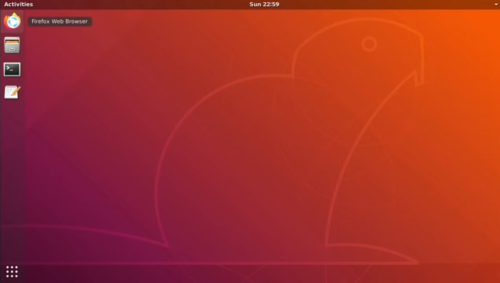

# LinuxHLE
</div>
<p align="Center">

</p>
<p align="Center">

</p>
<p align="Center">
A High level linux distro "Ubuntu 20" emulator for android using Termux and VNCserver!


# Req
- 4 gb
- termux
- RealVNC

# Installing
- open termux
- updating ```pkg update``` (write commands)
- install wget ```pkg install wget proot -y```
- copy repo. ```wget https://raw.githubusercontent.com/TypedQue/LinuxHLE/master/ubuntu.sh```
- bashing ```bash ubuntu.sh```
- starting ```./startubuntu.sh```
- Ubuntu install, next, install vnc and gnome on Ubuntu
- ```./startubuntu.sh```
- ```apt update```
- <details>
  <summary>Gnome</summary>
 
  ```apt install gnome-shell gnome-terminal nautilus gnome-tweaks gnome-shell-extension-ubuntu-dock light-themes suru-icon-theme gedit dbus-x11 tigervnc-standalone-server nano -y```
 
  </details>
  <details>
  <summary>xfce4</summary>
 
  ```apt install xfce4 xfce4-goodies xorg dbus-x11 x11-xserver-utils tigervnc-standalone-server nano -y```
 
  </details>
- xfce4 starting script ```wget https://raw.githubusercontent.com/TypedQue/LinuxHLE/master/xstartupxfce4```
- gnome starting script ```wget https://raw.githubusercontent.com/TypedQue/LinuxHLE/master/xstartuplh```
- ```chmod +x xstartuplh``` - for gnome
- ```chmod +x xstartupxfce4``` - for xfce4
- start vnc ```vncserver -localhost no``` and enter any password
- open RealVNC
- click plus, in Addres write ```localhost:1```, in name write any name
- done!
# Startup
- ```./startubuntu.sh```
- ```chmod +x xstartuplh```
- ```vncserver -localhost no``` any password
- open vnc
- open you server
# Shutdown
- ```vncserver -kill :1```
# Status
- > ### Pre Release

| Distribution  | XFCE4 | GNOME |
|:-------------- |:------:|:------:|
| [Ubuntu 20.04](https://github.com/TypedQue/LinuxHLE/releases/tag/v2) | ✔, not stable | ✔ |

# Authors
- TypedQue (team)
- [@SynthouS](https://youtube.com/SynthouS)
- @Merryweath
